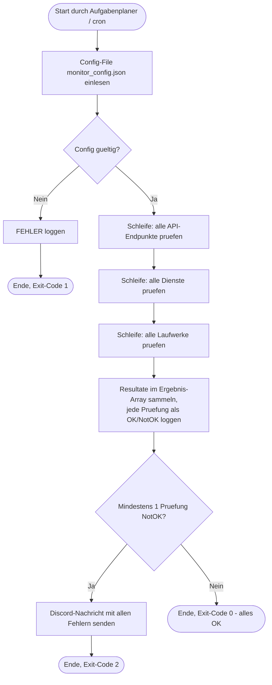

# Automatisierter System- & API-Infrastruktur-Monitor (LB3)

PowerShell-Skript, das automatisiert API-Endpunkte, Windows-Dienste und den Festplattenplatz ueberwacht, alles in Log-Files protokolliert (OK / NotOK) und bei Problemen automatisch eine Discord-Benachrichtigung verschickt.

## Dateien

| Datei | Zweck |
|---|---|
| `SystemApiInfrastrukturMonitor.ps1` | Hauptskript (Funktionen, Arrays, Schleifen) |
| `monitor_config.json` | Externes Config-File (Endpunkte, Dienste, Schwellwert, Discord-Webhook) |
| `logs/monitor_JJJJ-MM-TT.log` | Wird automatisch erstellt, ein Logfile pro Tag |

## Erfuellung der LB3-Anforderungen

- **a) Grafische Darstellung:** Ablaufdiagramm unten (Mermaid, rendert direkt auf GitHub/GitLab).
- **b) Kommentiert:** Jede Funktion und jeder Programmschritt ist im Code erklaert.
- **c) Funktionen / Arrays / Schleifen:** 6 Funktionen; Arrays: `$allePruefErgebnisse`, `$laufwerkErgebnisse`, `$nachrichtenZeilen`, Config-Arrays; Schleifen: mehrere `foreach`.
- **d) Automatisierter Start:** Windows-Aufgabenplaner (Anleitung unten), unter Linux via cron.
- **e) Log-Files:** Jede Pruefung wird mit Zeitstempel als `[OK]` oder `[NOTOK]` protokolliert, plus Start/Ende und Zusammenfassung pro Durchlauf.
- **f) Benutzer-Info:** Discord-Webhook meldet automatisch alle fehlgeschlagenen Pruefungen.

## Ablaufdiagramm (Anforderung a)



## Einrichtung

1. Discord: Servereinstellungen -> Integrationen -> Webhooks -> neuen Webhook erstellen -> URL kopieren.
2. Die URL in `monitor_config.json` bei `discordWebhookUrl` eintragen.
3. Endpunkte, Dienste und Schwellwert nach Bedarf anpassen.
4. Manuell testen (normale Konsole, **nicht** die ISE/VSC):

```powershell
powershell.exe -ExecutionPolicy Bypass -File C:\Skripte\monitor-projekt\SystemApiInfrastrukturMonitor.ps1
```

## Automatisierung mit dem Windows-Aufgabenplaner (Anforderung d)

Als Administrator in PowerShell ausfuehren (Pfad anpassen), erstellt eine Aufgabe, die alle 15 Minuten laeuft:

```powershell
$aktion = New-ScheduledTaskAction -Execute "powershell.exe" `
    -Argument "-NoProfile -ExecutionPolicy Bypass -File C:\Skripte\monitor-projekt\SystemApiInfrastrukturMonitor.ps1"

$ausloeser = New-ScheduledTaskTrigger -Once -At (Get-Date) `
    -RepetitionInterval (New-TimeSpan -Minutes 15)

Register-ScheduledTask -TaskName "InfrastrukturMonitor" `
    -Action $aktion -Trigger $ausloeser `
    -Description "LB3: Automatisierter System- und API-Monitor"
```

Kontrolle: `Get-ScheduledTask -TaskName "InfrastrukturMonitor"` oder im Aufgabenplaner-GUI unter "Aufgabenplanungsbibliothek".

## Ausfuehrung auf Linux/Unix-Konsole (Abgabe-Anforderung)

Das Skript laeuft auch mit PowerShell Core (`pwsh`) auf Linux. Die Windows-Dienst-Pruefung wird dort automatisch uebersprungen und als INFO geloggt.

```bash
# PowerShell Core installieren (Ubuntu/Debian): sudo snap install powershell --classic
pwsh ./SystemApiInfrastrukturMonitor.ps1

# Automatisierung via crontab (alle 15 Minuten):
# crontab -e, dann:
*/15 * * * * /snap/bin/pwsh /home/benutzer/monitor-projekt/SystemApiInfrastrukturMonitor.ps1
```

## Beispiel-Logauszug (Anforderung e)

```
[2026-07-02 14:30:00] [INFO  ] ===== Monitor-Durchlauf gestartet =====
[2026-07-02 14:30:01] [OK    ] API 'GitHub API' -> Status 200, Antwortzeit 342ms
[2026-07-02 14:30:02] [NOTOK ] API 'HTTPBin Status-Test' NICHT erreichbar: Timeout
[2026-07-02 14:30:02] [OK    ] Dienst 'Spooler' laeuft
[2026-07-02 14:30:03] [NOTOK ] Laufwerk 'C' -> nur noch 6.2% frei (Limit: 10%)
[2026-07-02 14:30:03] [INFO  ] Zusammenfassung: 3 von 5 Pruefungen OK, 2 NotOK
[2026-07-02 14:30:04] [INFO  ] Discord-Benachrichtigung erfolgreich versendet
[2026-07-02 14:30:04] [INFO  ] ===== Monitor-Durchlauf beendet (mit Fehlern) =====
```

## Git-Hinweis

Beim Einchecken in GitHub/GitLab die echte Webhook-URL **nicht** committen: eine `monitor_config.beispiel.json` mit Platzhalter einchecken und die echte `monitor_config.json` in die `.gitignore` aufnehmen:

```
monitor_config.json
logs/
```

## Exit-Codes

| Code | Bedeutung |
|---|---|
| 0 | Alle Pruefungen OK |
| 1 | Config-Fehler (File fehlt oder ungueltiges JSON) |
| 2 | Mindestens eine Pruefung NotOK |
